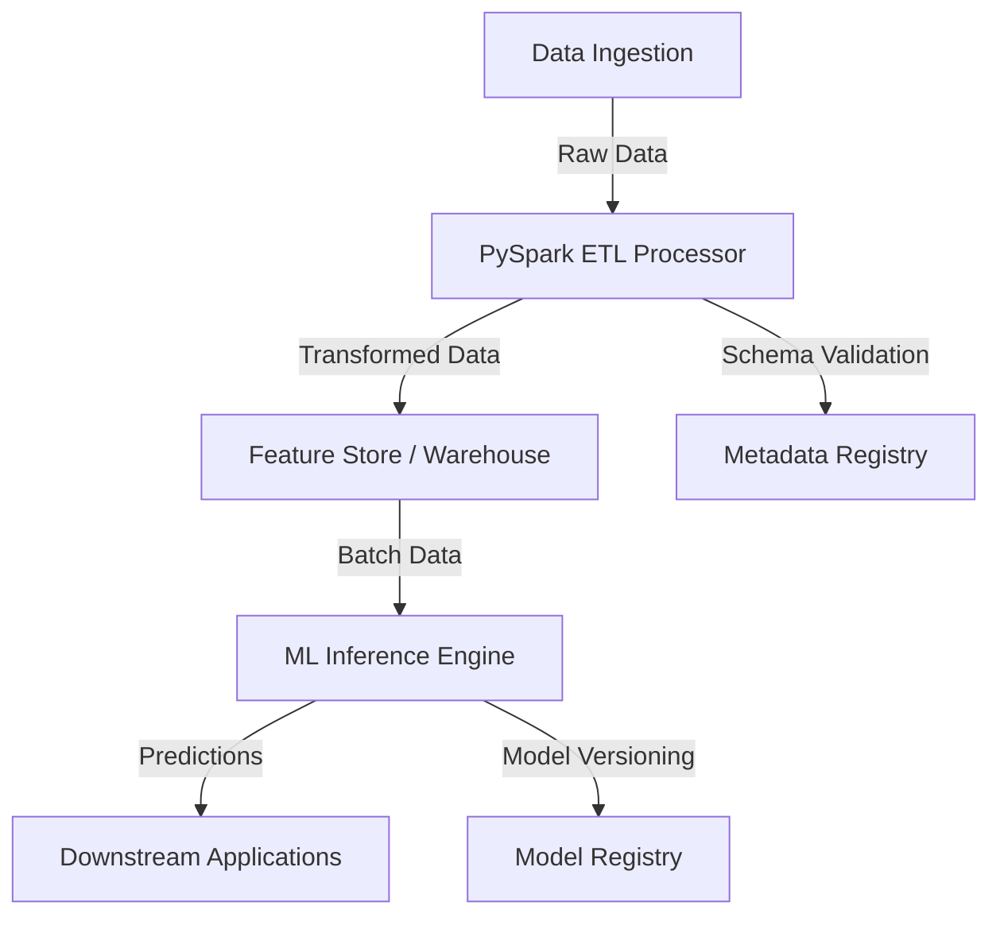

# Scalable Data & AI Orchestrator

An enterprise-grade, production-ready framework for building scalable data pipelines, PySpark-based ETL processes, and seamless machine learning integration.

## Architecture Overview

The system is designed with a modular architecture that separates data ingestion, processing, and inference. It leverages Apache Spark for distributed data processing and provides a robust orchestration layer for end-to-end pipeline management.



### Key Components

- **PySpark ETL Processor**: Modular implementation for high-throughput data processing, schema enforcement, and transformation logic.
- **ML Inference Engine**: Lightweight, optimized wrapper for batch and real-time model predictions.
- **Pipeline Orchestrator**: Manages the lifecycle of data workflows, ensuring fault tolerance and observability.
- **Infrastructure**: Multi-stage Dockerized Spark environment for consistent deployment across environments.

## Features

- **Scalability**: Designed for petabyte-scale data processing using Apache Spark.
- **Type Safety**: Extensive use of Python type hinting and Pydantic for schema validation.
- **Modularity**: Decoupled components for easier testing and maintenance.
- **DevOps Ready**: Integrated Dockerization and comprehensive testing suite.

## Getting Started

### Prerequisites

- Docker
- Python 3.9+
- Apache Spark 3.x

### Installation

```bash
pip install -r requirements.txt
```

### Running the Pipeline

```bash
python src/pipelines/orchestrator.py --config configs/production.yaml
```

## Repository Structure

```text
Scalable-Data-AI-Orchestrator/
├── infrastructure/           # Infrastructure as Code (Dockerfile, etc.)
├── src/
│   ├── etl/                  # PySpark processing logic
│   ├── models/               # ML Inference and model handling
│   └── pipelines/            # Pipeline orchestration
├── tests/                    # Unit and integration tests
├── requirements.txt          # Python dependencies
└── README.md                 # Project documentation
```

## License

MIT License
